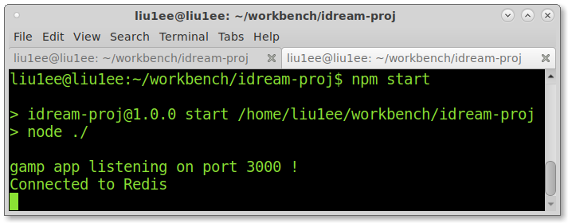
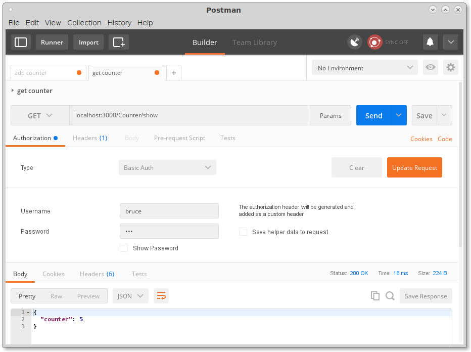
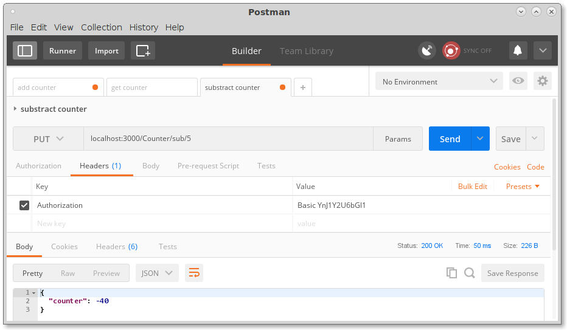
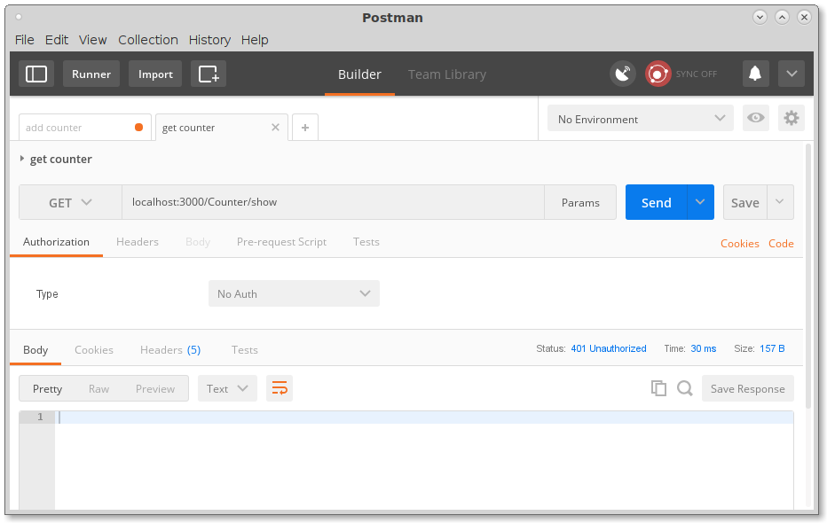
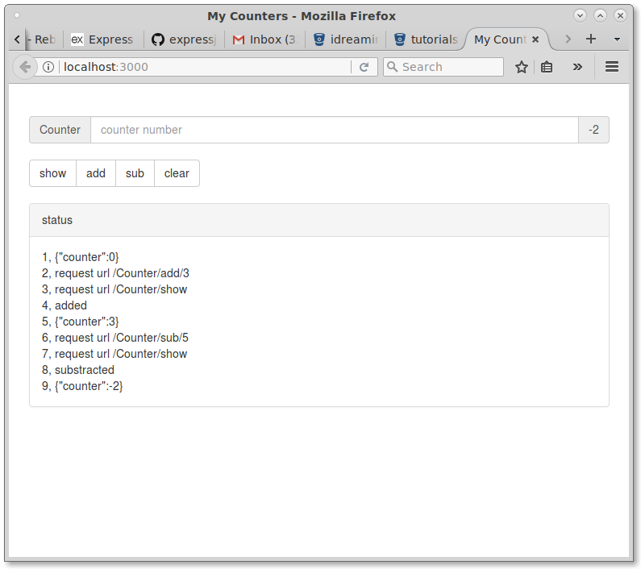

# idream-proj
a sample project to use nodejs to build a RESTfull API server

feautre :
+ authentication basic
+ UI confirm dialogue box
+ Redislabs cloud key-value save
+ minify all html, js, css code
****
##how to run it;
```shell
	git clone git@bitbucket.org:idreaminteractive/nodejstest0002.git idream
	cd idream
	npm install
	gulp build
	npm start
```

##Use PostMan to test the api
+ get: localhost:3000/Counter/show
+ put: localhost:3000/Counter/add/1
+ put: localhost:3000/Counter/sub/1
+ put: localhost:3000/Counter/clear

##how to run from-end:
run the server with the same  command  npm start then

type  http://localhost:3000/index.html in your browser.

authentication module

if you open localhost:3000 a authentication window will

pop up, then you will input
```
	username: bruce
	password: liu
```
to access the server resouces
****
##somescreen shot







